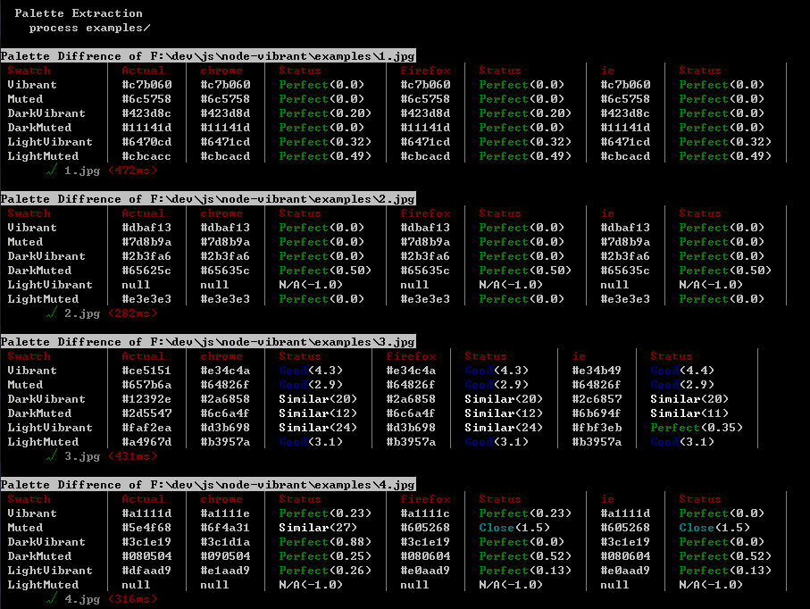

# node-vibrant
[](https://travis-ci.org/akfish/node-vibrant)

Extract prominent colors from an image.

## Update Notes
- Some major refactor/rewriting comes with `node-vibrant@2.0.0`:
  - Closely matches latest Android M `Palette` API with new features such as `Builder` and `Filter`
  - Optimization: **~4x speed-up** over original implementation
  - Implement image downsampling for both node.js and browsers
  - More stream-lined design
  - Better test coverage for both node.js and browser environment

- `node-vibrant@1.x` is a node.js port of [Vibrant.js](https://github.com/jariz/vibrant.js), which is a javascript port of the [awesome Palette class](https://developer.android.com/reference/android/support/v7/graphics/Palette.html) in the Android support library.

## Features
- Identical (asynchronous) API for both node.js and browser environment
- Support browserify
- Consistent results (*See [Result Consistency](#result-consistency))

## Install

```bash
$ npm install node-vibrant
```

## Usage
### node.js / browserify

```coffee
# Use in node.js or bundle with browserify
Vibrant = require('node-vibrant')

# Using builder
Vibrant.from('path/to/image').getPalette (err, palette) ->
    console.log palette

# Using constructor
v = new Vibrant('path/to/image', opts)
v.getPalette (err, palette) ->
  console.log(swatches)
```

### Browser

```html
<!-- Debug version -->
<script src="/path/to/dist/vibrant.js"></script>
<!-- Uglified version -->
<script src="/path/to/dist/vibrant.min.js"></script>

<script>
  // Use `Vibrant` in script
  // Vibrant is exported to global. window.Vibrant === Vibrant
  Vibrant.from('path/to/image').getPalette(function(err, palette) {});
  // Or
  var v = new Vibrant('/path/to/image', opts);
  // ... same as in node.js
</script>
```

## Contribution Guidelines
1. Make changes
2. Write test specs if necessary
3. Pass tests
4. Commit **source files only** (without compiled files)

## References
### `Vibrant`
Main class of `node-vibrant`.

#### `Vibrant.from(image)`
Make a `Builder` for an image. Returns a `Builder` instance.

Name    | Type                               | Description
------- | ---------------------------------- | ---------------------------------------
`image` | `string` or `Buffer`(node.js only) | Path to image file (support HTTP/HTTPs)

#### `constructor(image, opts)`

Name    | Type                               | Description
------- | ---------------------------------- | ---------------------------------------
`image` | `string` or `Buffer`(node.js only) | Path to image file (support HTTP/HTTPs)
`opts`  | object                             | Options (optional)

##### `opts`

Field          | Default                         | Description
-------------- | ------------------------------- | -------------------------------------------------------------------------------------------------------------------------------
`colorCount`   | 64                              | amount of colors in initial palette from which the swatches will be generated
`quality`      | 5                               | Scale down factor used in downsampling stage. `1` means no downsampling. If `maxDimension` is set, this value will not be used.
`generator`    | `Vibrant.Generator.Default`     | An `Generator` instance
`maxDimension` | `undefined`                     | The max size of the image's longer side used in downsampling stage. This field will override `quality`.
`filters`      | `[]`                            | An array of filters
`Image`        | `Image.Node` or `Image.Browser` | An `Image` implementation class
`Quantizer`    | `Vibrant.Quantizer.NoCopy`      | A `Quantizer` implementation class

#### `getPalette(cb)`

Name | Type       | Description
---- | ---------- | -----------------
`cb` | `function` | callback function

##### `cb(err, palette)`

Name      | Type            | Description
--------- | --------------- | ------------------
`err`     | `object`        | Error (if thrown)
`palette` | `Array<Swatch>` | Resulting swatches

#### `getSwatches(cb)`
Alias of `getPalette`.

### `Vibrant.Builder`
Helper class for change configurations and create a `Vibrant` instance. Methods of a `Builder` instance can be chained like:

```coffee
Vibrant.form(src)
  .quality(1)
  .clearFilters()
  # ...
  getPalette (err, palette) ->
```

#### `constructor(src, opts)`
Arguments are the same as `Vibrant.constructor`.

#### `quality(q)`
Sets `opts.quality` to `q`. Returns this `Builder` instance.

#### `maxColorCount(n)`
Sets `opts.colorCount` to `n`. Returns this `Builder` instance.

#### `maxDimension(d)`
Sets `opts.maxDimension` to `d`. Returns this `Builder` instance.

#### `addFilter(f)`
Adds a filter function. Returns this `Builder` instance.

#### `removeFilter(f)`
Removes a filter function. Returns this `Builder` instance.

#### `clearFilters()`
Clear all filters. Returns this `Builder` instance.

#### `useImage(image)`
Specifies which `Image` implementation class to use. Returns this `Builder` instance.

#### `useQuantizer(quantizer)`
Specifies which `Quantizer` implementation class to use. Returns this `Builder` instance.

#### `useGenerator(generator)`
Sets `opts.generator` to `generator`. Returns this `Builder` instance.

#### `build()`
Builds and returns a `Vibrant` instance as configured.

#### `getPalette(cb)`
Builds a `Vibrant` instance as configured and calls its `getPalette` method.

#### `getSwatches(cb)`
Alias of `getPalette`.

### `Vibrant.Swatch`
Represents a color swatch generated from an image's palette.

#### `constructor(rgb, population)`
Internal use.

Name         | Type            | Description
------------ | --------------- | -----------------------------------
`rgb`        | `Array<Number>` | `[r, g, b]`
`population` | `Number`        | Population of the color in an image

#### `getHsl()`
#### `getPopulation()`
#### `getRgb()`
#### `getHex()`
#### `getTitleTextColor()`
Returns an appropriate color to use for any 'body' text which is displayed over this `Swatch`'s color.

#### `getBodyTextColor()`
Returns an appropriate color to use for any 'title' text which is displayed over this `Swatch`'s color.

### `Vibrant.Util`
Utility methods. Internal usage.

#### `clone(o)`
Make a deep copy of `o`.

#### `defaults()`
Same as underscore.js's `defaults`. Re-implemented to reduce browserify package size.

#### `hexToRgb(hex)`
#### `rgbToHex(r, g, b)`
#### `hslToRgb(h, s, l)`
#### `rgbToHsl(r, g, b)`
#### `xyzToRgb(x, y, z)`
#### `rgbToXyz(r, g, b)`
#### `xyzToCIELab(x, y, z)`
#### `rgbToCIELab(l, a, b)`
#### `deltaE94(lab1, lab2)`
Computes CIE delta E 1994 diff between `lab1` and `lab2`. The 2 colors are in CIE-Lab color space. Used in tests to compare 2 colors' perceptual similarity.

#### `rgbDiff(rgb1, rgb2)`
Compute CIE delta E 1994 diff between `rgb1` and `rgb2`.

#### `hexDiff(hex1, hex2)`
Compute CIE delta E 1994 diff between `hex1` and `hex2`.

#### `getColorDiffStatus(d)`
Gets a string to describe the meaning of the color diff. Used in tests.

Delta E  | Perception                             | Returns
-------- | -------------------------------------- | -----------
<= 1.0   | Not perceptible by human eyes.         | `"Perfect"`
1 - 2    | Perceptible through close observation. | `"Close"`
2 - 10   | Perceptible at a glance.               | `"Good"`
11 - 49  | Colors are more similar than opposite  | `"Similar"`
50 - 100 | Colors are exact opposite              | `Wrong`

### `Vibrant.Filter`
A collection of built-in filters.

#### `Filter(r, g, b, a): function<boolean>`
A `Filter` provides a mechanism for exercising fine-grained control over which colors are valid within a resulting. It takes color's rgba value and returns `true` if the color is allowed.

#### `Filter.Default`
Keeps the original `vibrant.js`'s filtering behavior as reference.

### `Vibrant.Quantizer`
Base class of a `Quantizer`.

#### `Quantizer.MMCQ`
Default quantizer. ~4x faster than baseline quantizer. (Rewritten version of `NoCopy`)

#### `Quantizer.NoCopy`
Optimized quantizer. ~4x faster than baseline quantizer.

#### `Quantizer.Baseline`
Original `vibrant.js` quantizer. Used for tests and benchmarks only. It does not support downsampling nor filters.

### `Vibrant.Generator`
Base class for `Generator`.

#### `Generator.Default`
Default `Generator` implementation.

##### `constructor(opts)`
##### `opts`

Field                     | Default | Description
------------------------- | ------- | ---------------------------------------------------------------------------------------------------------
`targetDarkLuma`          | 0.26    | target luma value for generating the dark swatches, values should be in the range [0 1]
`maxDarkLuma`             | 0.45    | maximal luma threshold for generating the dark swatches, values should be in the range [0 1]
`minLightLuma`            | 0.55    | minimal luma threshold for generating the light swatches, values should be in the range [0 1]
`targetLightLuma`         | 0.74    | target luma value for generating the light swatches, values should be in the range [0 1]
`minNormalLuma`           | 0.3     | minimal luma threshold for generating the Vibrant and Muted swatches, values should be in the range [0 1]
`targetNormalLuma`        | 0.5     | target luma value for generating the Vibrant and Muted swatches, values should be in the range [0 1]
`maxNormalLuma`           | 0.7     | maximal luma threshold for generating the Vibrant and Muted swatches, values should be in the range [0 1]
`targetMutedSaturation`   | 0.3     | target saturation for generating the Muted swatch, values should be in the range [0 1]
`maxMutesSaturation`      | 0.4     | maximal saturation threshold for generating the Muted swatches, values should be in the range [0 1]
`targetVibrantSaturation` | 1.0     | target saturation value for generating the Vibrant swatches, values should be in the range [0 1]
`minVibrantSaturation`    | 0.35    | minimal saturation threshold for generating the Vibrant swatches, values should be in the range [0 1]
`weightSaturation`        | 3       | saturation weight coefficient for determining each swatch, actual impact depends on other weights
`weightLuma`              | 6       | luma weight coefficient for determining each swatch, actual impact depends on other weights
`weightPopulation`        | 1       | population weight coefficient for determining each swatch, actual impact depends on other weights

## Gulp Tasks

Task           | Description
-------------- | --------------------------------------
`detaul`       | [`coffee`, `browser`]
`coffee`       | Compile node.js target
`browser`      | Compile broser target (browserify)
`benchmark`    | Runs benchmarks
`test`         | Runs node.js test specs
`browser-test` | Runs browser test specs (with `karma`)

## Notes
### Intentional Deviation From `vibrant.js`
- `node-vibrant` takes image path, not the image object as parameter for the obvious reason that node.js environment has no access to HTML DOM object.
- `node-vibrant` provides asynchronous API since most node.js image processing library is asynchronous. And the original `vibrant.js` workflow is asynchronous any way (though you will have to handle the image loading yourself, while `node-vibrant` does it for you).
- `node-vibrant` uses one single `opts` object to hold all options for future expansions. And it feels more node.js-like.
- `node-vibrant` uses method call to initiate image processing instead of constructor so that developers can use it with `Promise`.

### Result Consistency
The results is consistent within each user's browser instance regardelss of visible region or display size of the image, unlike the original `vibrant.js` implementation.

However, due to the very nature of HTML5 canvas element, image rendering is platform/machine-dependent. Thus the resulting swatches in browser environment varies and may not be the same as in node.js nor in another machine. See [Canvas Fingerprinting](https://en.wikipedia.org/wiki/Canvas_fingerprinting).

The test specs use CIE delta E 1994 color difference to measure inconsistencies across platforms. It compares the generated color on node.js, Chrome, Firefox and IE11. At `quality` == 1 (no downsampling) and no filters, the results are rather consistent. Color diffs between browsers are mostly not perceptible by human eyes. Downsampling _will_ cause perceptible inconsistent results across browsers due to differences in canvas implementations.


