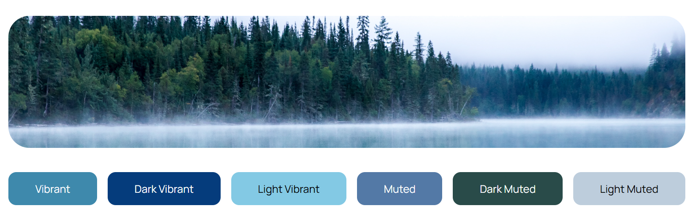

`node-vibrant` is a library that allows you to construct a color palette from an image.



By default it will extract the following types of colors from an image:

- Vibrant
- Dark Vibrant
- Light Vibrant
- Muted
- Dark Muted
- Light Muted

These colors can then be used to adapt a user interface to the media content they're looking at:

// TODO: Add mockup of music player and a news app with a cover image

This library works with the same API regardless of if you're using it in Node.js or a modern browser.

# Installation

To get started with the library, we'll install it using the following:

```shell
npm install node-vibrant
```

We'll need to make sure that we're either:

- Using a modern bundler like [Vite](https://vite.dev/)
- Taking advantage of [modern bundleless JS APIs in the browser](https://playfulprogramming.com/posts/modern-js-bundleless)
- Utilizing the latest Node LTS version

Depending on your platform, you'll need to import from a different location:

```typescript
// Node.js usage
import { Vibrant } from "node-vibrant/node";
// Browser usage
import { Vibrant } from "node-vibrant/browser";
```

## Worker Installation

[Web Workers allow time-consuming operations, like image quantization, run on a separate thread than the main UI thread in JavaScript.](https://developer.mozilla.org/en-US/docs/Learn_web_development/Extensions/Async_JS/Introducing_workers)

Workers, being imported via URL traditionally, require a bit more setup than the other two methods:

```typescript
// Worker usage
import { Vibrant, WorkerPipeline } from "node-vibrant/worker";
import PipelineWorker from "node-vibrant/worker.worker?worker";

Vibrant.use(new WorkerPipeline(PipelineWorker as never));
```

# Usage

Now that we have access to the `Vibrant` class instance, we have two different methods of getting our color palette:

```typescript
// Using builder
Vibrant.from("path/to/image")
	.getPalette()
	.then((palette) => console.log(palette));

// Using constructor
const vibrant = new Vibrant("path/to/image", opts);
vibrant.getPalette()
	.then((palette) => console.log(palette));
```

Once this is done, our palette will contain [the following type signature](../reference/vibrant-color/reference/interfaces/palette.md):

```typescript
interface Palette {
    Vibrant: Swatch;
    Muted: Swatch;
    DarkVibrant: Swatch;
    DarkMuted: Swatch;
    LightVibrant: Swatch;
    LightMuted: Swatch;
}
```

Where [`Swatch` is a class instance containing various helper properties and utilities pertaining to a color](../reference/vibrant-color/reference/classes/swatch.md).

## Swatch Usage

There are a few main utilities in `Swatch` that I want to highlight:

```typescript
palette.Vibrant.hex; // "#rrggbb
palette.Vibrant.rgb; // [r, g, b] where r, g, and b are numbers
palette.Vibrant.hsl; // [hue, saturation, light] where all are numbers
palette.Vibrant.titleTextColor; // "#fff" (white) if the color is too dark, "#000" (black) if the background is light
palette.Vibrant.bodyTextColor; // Same as titleTextColor but with lower contrast threshold
```


# Demo Usage

```typescript
import { Vibrant } from "node-vibrant/browser";

Vibrant.from("https://avatars.githubusercontent.com/Vibrant-Colors").getPalette()
  .then(palette => {
    app.innerHTML = `
    	<p style="background-color: ${palette.Vibrant?.hex}; color: ${palette.Vibrant?.bodyTextColor};">Vibrant</p>
    `
  })
```

<iframe src="https://stackblitz.com/github/Vibrant-Colors/node-vibrant/tree/v4/examples/js/simple?template=node&amp;ctl=1&amp;embed=1&amp;file=src%2Fmain.ts&amp;hideNavigation=1&amp;view=preview" title="Node Vibrant Browser Demo" allow="geolocation; microphone; camera; midi; vr; accelerometer; gyroscope; payment; ambient-light-sensor; encrypted-media; usb" sandbox="allow-modals allow-forms allow-popups allow-scripts allow-same-origin"></iframe>